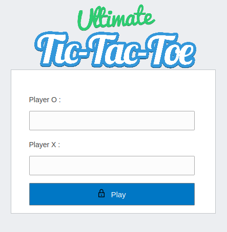
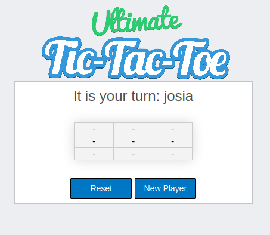

# TicTacToe JavaScript Project

In this project we have made a Tic Tac Toe game you can play in your browser and add some tests with Jest!

## Built with

  * Javascript
  * HTML5
  * CSS3
  * Jest
  * npm
  * webpack

## Getting Started:

To get a local copy up and running follow these simple example steps:

1. Under the repository name, click the Clone or download green button.

2. Copy the URL given by clicking the clipboard button

3. Open a terminal window in your local machine and change the current directory to the one you
   want the clone directory to be made.

4. Type  git clone and then paste the URL you previously copied to the clipboard

5. Open a new terminal window in your local machine and change the current directory to your
   cloned directory.

6. Run `npm install` / `npm i` from the Terminal

7. after that `npm run build` from the terminal

8. And, Open dist/index.html page with browser

9. Then `npm run test` from the terminal

## See a live demo [Here](https://raw.githack.com/rindrajosia/tictactoe-js/feature/index.html)

## Show your support
Give a ⭐️ if you like this project!

# Screenshot

* Player name
* 

* Board game
* 

* Testing
* 

## Authors

👤 **Edie Atha**

- Github: [@edieatha](https://github.com/edieatha)
- Twitter: [@edieatha](https://twitter.com/edieatha)
- Linkedin: [linkedin](https://www.linkedin.com/in/edieatha/)
 Email: [email](edieatha@gmail.com)

👤 **Rindra josia**

* Github: **[@rindrajosia](https://github.com/rindrajosia)**
* Twitter: **[@rindrajosia](https://twitter.com/josia_rindra)**
* Linkedin: **[linkedin](https://www.linkedin.com/in/rindra-josia-99b2111a2/)**

## 🤝 Contributing

Contributions, issues and feature requests are welcome!

Feel free to check the [issues page](https://github.com/rindrajosia/test-tictac/issues).
